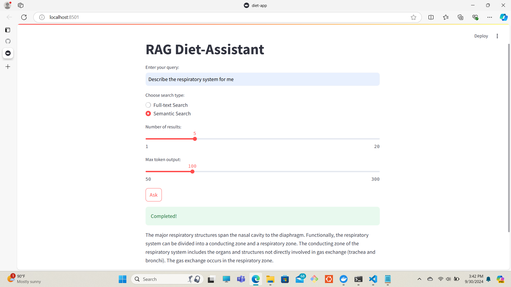
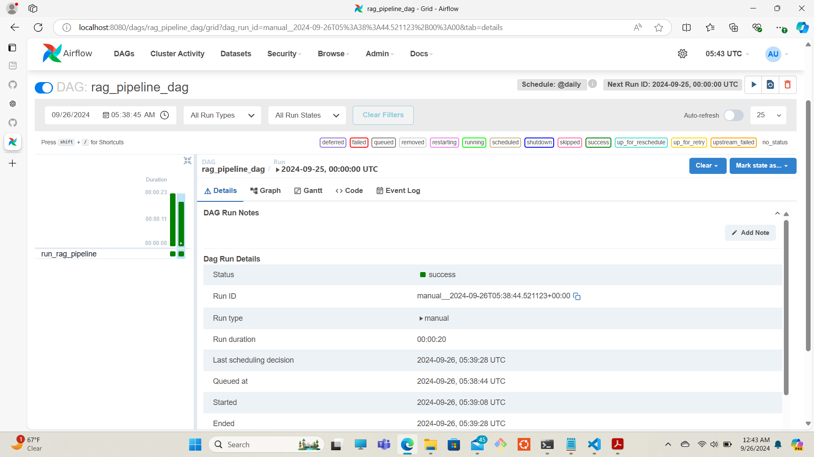
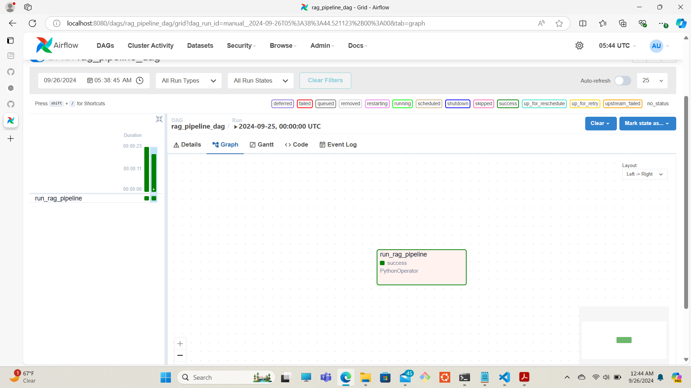
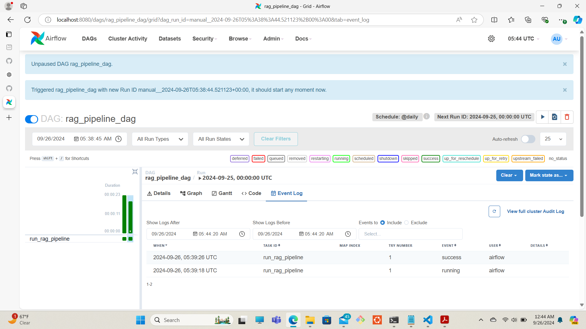
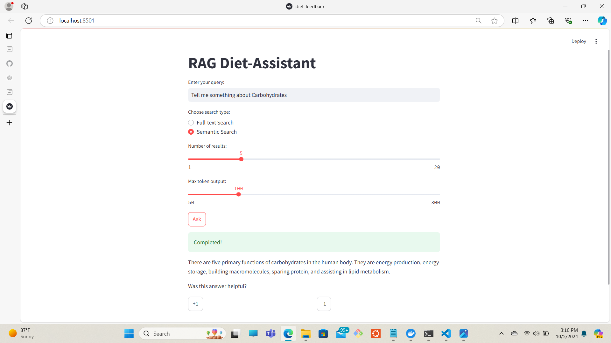
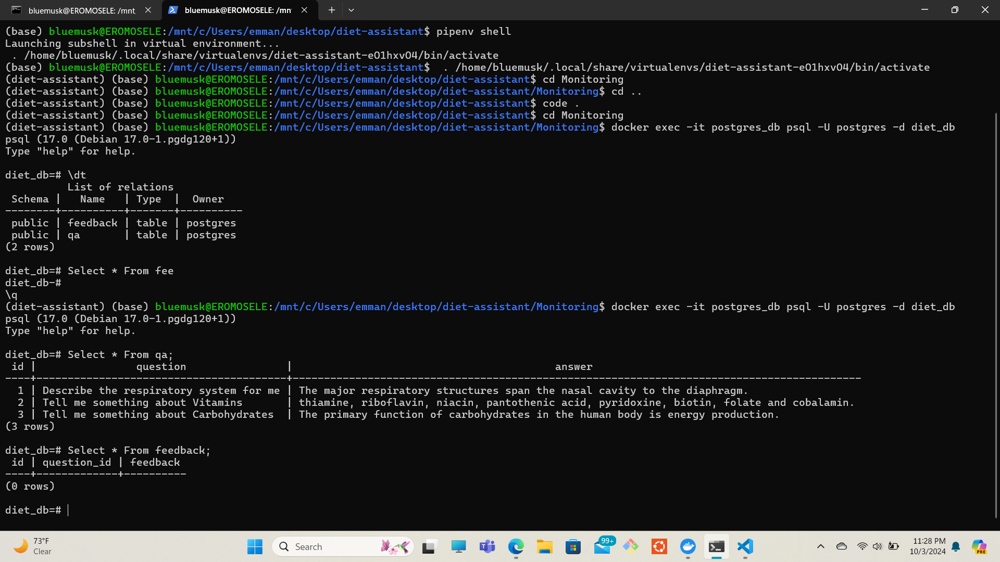
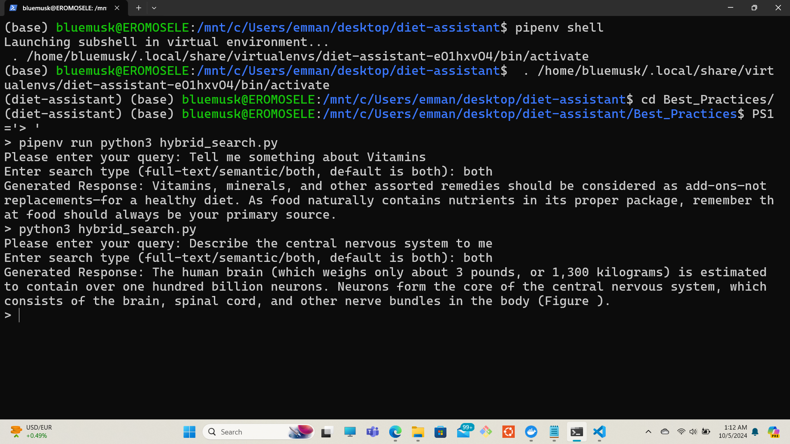

## Project Title: Diet-Assistant RAG System

<p align="center">
  
</p>

### Problem description:

Are you an individual struggling to track his/her food intake or lack knowledge about the nutritional content of meals, leading to unhealthy eating habits? Do you lack motivation to read nutritional books to gain knowledge on nutrional science? Look no further because a diet assitant is the solution!

A diet assistant helps users monitor and understand their eating habits by providing personalized insights into their dietary patterns. The assistant can solve this by offering features like calorie counting, macronutrient tracking, and food recommendations based on health goals or dietary restrictions, enabling users to make informed decisions and stay on track with their health objectives.

In this project, I will be building a diet-assistant RAG (`Retrieval-Augmented Generation`) system, designed to enhance the quality and accuracy of dietary advice by combining information retrieval with generative AI capabilities. Here's how it works:

1. ***Retrieval Component***: The system first retrieves relevant information from a knowledge database. This includes nutritional information, dietary guidelines, recipes, and user-specific data like dietary preferences and restrictions.

2. ***Generation Component***: After retrieving the necessary information, the system uses a `generative open-source model` to synthesize and generate personalized dietary advice/nutrient information. This ensures the advice and knowledge is not only accurate but also contextually relevant and easy to understand.

3. ***Personalization***: The system can tailor recommendations based on individual user data, such as health goals, allergies, and dietary preferences. This makes the advice and knowledge more relevant and actionable for the user.

4. ***Dynamic Updates***: The RAG system can continuously update its recommendations based on new data, such as changes in the user's health status or new dietary/nutritional research.

Overall, a diet assistant RAG system aims to provide more accurate, personalized, and contextually rich dietary knowledge compared to traditional methods.

For more information on the pdf documents used for this project: [Nutrition Science](https://github.com/bluemusk24/LLM-diet-assitant/blob/main/RAG_flow/Introduction%20to%20Nutrition%20Science%2C%20LibreTexts%20Project.pdf)

**Technology Used** - not discussed in the class:

1. ***Langchain*** - a python library (framework) designed to simplify the creation of applications using large language models.

2. ***LanceDB*** - a knowledge database for creating schemas, tables, and extracting a dataframe from the stored chunks and vector embeddings of pdf documents.

3. ***Pyarrow*** - an open-source library that facilitates efficient in-memory data representation

4. ***Tantivy*** - a python library used for creating indexes and search retrieval on LanceDB. For more info on this technology, see [LanceDB](https://lancedb.github.io/lancedb/fts/) documentation.

5. ***llama-cpp-python*** - required for quantized meta llama models with CPU.

6. ***ctransformers*** - required to run quantized models locally with CPU.

### Environment Preparation on WSL:

* pipenv was used to create environment and isolate dependencies for this environment

```bash
mkdir diet-assistant

pip install pipenv

pipenv shell

pipenv install -r requirements.txt
```

### RAG Flow:

1. ***using meta llama3 locally***

* The [ollama_diet_assistant_RAG](https://github.com/bluemusk24/LLM-diet-assitant/blob/main/rough_ollamaRAG.ipynb) notebook process was done on Google Colab because of access to GPU. To use llama3 locally, run the following:

```bash
curl -fsSL https://ollama.com/install.sh | sh

nohup ollama serve > nohup.out 2>&1 &

pip install ollama

import ollama
```

* To delete llama3 locally after the project

```bash
ollama list

ollama rm llama3:latest
```

2. ***using Google flan-T5-Large from HuggingFace*** [google/flan-t5-large](https://huggingface.co/google/flan-t5-large)

[diet-assitant-ragflow](https://github.com/bluemusk24/LLM-diet-assitant/blob/main/RAG_flow/diet-assistant-ragflow.ipynb) notebook contains the procedures for using this model and [PDF_docs](https://github.com/bluemusk24/LLM-diet-assitant/blob/main/RAG_flow/Introduction%20to%20Nutrition%20Science%2C%20LibreTexts%20Project.pdf) is the data used.

### Evaluation:

* [retrieval_evaluation](https://github.com/bluemusk24/LLM-diet-assitant/blob/main/Evaluation/retrieval_evaluation.ipynb) notebook contains both `Hit Rate and MRR` evaluation metrics for retrieving queries. 

**Offline-rag-evaluation for text-search**

* [RAG_eval_textsearch](https://github.com/bluemusk24/LLM-diet-assitant/blob/main/Evaluation/RAG_eval_textsearch.ipynb) notebook contains different offline rag evaluation approaches for text search:

1. ***Precision*** - measures how many of the tokens in the response are relevant (i.e. present in the query). The precision for the above query is 5%.

2. ***Recall*** - measures how many of the query tokens are captured in the response. The recall for the above query is 67%.

`query = 'What are nutrients'`
`response = rag_pipeline(query, model, tokenizer)`

`precision, recall = exact_match_evaluation(query, response)`
`print(f"Precision: {precision:.2f}, Recall: {recall:.2f}")`

`The exact match of the query_tokens and response_tokens is {'nutrients', 'are'}`
`Precision: 0.05, Recall: 0.67`

3. ***LLM-as-as-Judge*** - [google/flan-t5-base](https://huggingface.co/google/flan-t5-base) gave evaluation of 100% for this query:

`query = 'What are nutrients'`
`response = rag_pipeline(query, model, tokenizer)`

`rating = llm_as_a_judge(prompt, judge_model, judge_tokenizer)`
`print(f"LLM Judge Rating: {rating}")`

`LLM Judge Rating: 100`

**Offline-rag-evaluation for semantic search**

* [RAG_eval_vectorsearch](https://github.com/bluemusk24/LLM-diet-assitant/blob/main/Evaluation/RAG_eval_vectorsearch.ipynb) notebook contains different offline rag evaluation approaches for semantic search:

1. ***Cosine Similarity*** - measures how similar the query and response are to themselves. Example is the query and response below:

`query = 'Describe the Central Nervous System'`
`response = rag_pipeline(query, new_table, model, tokenizer)`

`cosine_similarity = compute_cosine_similarity(query=query, response=response)`

`Cosine Similarity between this Query and RAG Response is 81.96%`

2. ***LLM-as-as-Judge*** - the query below gives both the cosine similarity of the query and response, and the rating of LLM.

`query = 'Describe the respiratory system for me'`
`response = rag_pipeline(query, new_table, model, tokenizer)`

`compute_cosine_similarity(query=query, response=response)`

`rating = llm_as_a_judge(prompt, judge_model, judge_tokenizer)`
`print(f"LLM Judge Rating: {rating}%")`

`Cosine Similarity between this Query and RAG Response is 83.28%`
`LLM Judge Rating: 100%`

### Streamlit Interface:

* mkdir Streamlit_Interface

* copy `diet-assitant-ragflow.ipynb` to directory and convert to a python script [diet-assitant.py](https://github.com/bluemusk24/LLM-diet-assitant/blob/main/Streamlit_Interface/diet-assistant.py)

```bash
cd Streamlit-app

cp RAG_flow/diet-assistant-ragflow.ipynb Streamlit-app/

jupyter nbconvert --to script diet-assistant-ragflow.ipynb

streamlit run diet-assistant.py
```

* Access the streamlit web UI at `http://localhost:8501` where you can monitor and query the interface.

* Pictorial view of the `streamlit-app`

<p align="center">
  
</p>

### Ingestion Pipeline with Apache Airflow:

***Airflow*** - open-source platform for orchestrating, scheduling, and monitoring batch-oriented workflows. [Apache-Airflow-Documentation](https://airflow.apache.org/docs/apache-airflow/stable/index.html)

***DAG*** - `Directed Acyclic Graphs` is Airflow’s representation of a workflow. The [rag_pipeline_dag.py](https://github.com/bluemusk24/LLM-diet-assitant/blob/main/Ingestion-pipeline/rag_pipeline_dag.py) is the `apache-airflow workflow(DAG)`. The process for the workflow orchestration below:

```bash
pip install apache-airflow

mkdir ~/airflow/dags

cp 'rag_pipeline_dag.py ~/airflow/dags

ls ~/airflow/dags

airflow users create \
    --username admin \
    --firstname Admin \
    --lastname User \
    --role Admin \
    --email admin@example.com \
    --password admin

airflow db migrate

airflow connections create-default-connections

airflow webserver

airflow scheduler
```

* Access the Airflow web UI at `http://localhost:8080` where you can monitor and manage your created DAGs. Click the icon Run and ensure it's successful.

* Check Logs: view the generated response in the task logs for `run_rag_pipeline` after the DAG runs.

* Pictorial views - `apache-airflow1, apache-airflow2, apache-airflow3`

<p align="center">
  
</p>

<p align="center">
  
</p>

<p align="center">
  
</p>

### Containerization:

* create a [dockerfile](https://github.com/bluemusk24/LLM-diet-assitant/blob/main/Containerization/dockerfile), build the image and run the container for the [streamlit_app.py](https://github.com/bluemusk24/LLM-diet-assitant/blob/main/Containerization/diet-app.py)

```bash
docker build -t diet-app .

docker run -it --rm -p 8501:8501 diet-app
```
***Note*** - use the semantic search (new_diet_table) with the query here on the `streamlit-ui`

### Monitoring with Feedback:

* Create a Monitoring folder that includes: 

- a folder for the Streamlit app called [app](https://github.com/bluemusk24/LLM-diet-assitant/tree/main/Monitoring/app)
- a [dockerfile](https://github.com/bluemusk24/LLM-diet-assitant/blob/main/Monitoring/app/dockerfile) for the Streamlit app inside the `app/` folder
- a [requirements.txt](https://github.com/bluemusk24/LLM-diet-assitant/blob/main/Monitoring/app/requirements.txt) file inside the `app/` folder
- a [diet-feedback.py](https://github.com/bluemusk24/LLM-diet-assitant/blob/main/Monitoring/app/diet-feedback.py) script inside the `app/` folder
- a [docker-compose.yml](https://github.com/bluemusk24/LLM-diet-assitant/blob/main/Monitoring/docker-compose.yaml) file in the root directory `Monitoring`
- a [grafana_datasource.yaml](https://github.com/bluemusk24/LLM-diet-assitant/blob/main/Monitoring/config/grafana_datasource.yml) file to access Postgres in Grafana

* Run the following in the root directory `Monitoring`

```bash
docker-compose up --build
```

* The above command will:

- Build the Streamlit app container using the Dockerfile
- Pull and start the PostgreSQL and Grafana containers
- Streamlit will be available on `http://localhost:8501`
- PostgreSQL will be running on port `5432`
- Grafana will be available on `http://localhost:3000`

Pictorial View of `Streanlit-Feedback`

<p align="center">
           
</p>

* To inspect the PostgreSQL container for created tables, run the following command in the terminal:

```bash
docker exec -it postgres_db psql -U postgres -d diet_db
```

* Load any of the tables in the Postgres database and perform some SQL:

```bash
\dt

SELECT * FROM qa;

SELECT * FROM feedback;
```

`Outcomes of queries on Postgres database table - qa:`

<p align="center">
  
</p>

* Run this command to shut the containers down

```bash
docker-compose down
```

### Best Practices

**Hybrid Search** - this [hybrid_search.py](https://github.com/bluemusk24/LLM-diet-assitant/blob/main/Best_Practices/hybrid_search.py) script combines both `text-search`, `vector-search` and LLM `google-flan-t5-large`.

*  I ran the following commands:

```bash
cd Best_Practices

pipenv shell

PS1='> '

pipenv run python3 hybrid_search.py

python3 hybrid_search.py
```
Pictorial View of `hybrid search`

<p align="center">
  
</p>

**Document Re-ranking** - [reranking.py](https://github.com/bluemusk24/LLM-diet-assitant/blob/main/Best_Practices/reranking.py) script
In LanceDB, document re-ranking can be done by re-scoring the search results based on additional criteria. When you perform an initial search, whether it’s a full-text search or a semantic search, you can reorder the results based on relevance using a custom scoring function.  

```bash
pipenv run python3 reranking.py
```